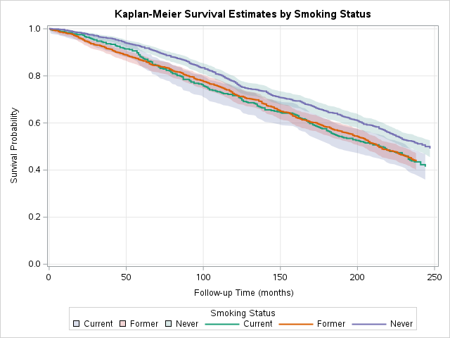
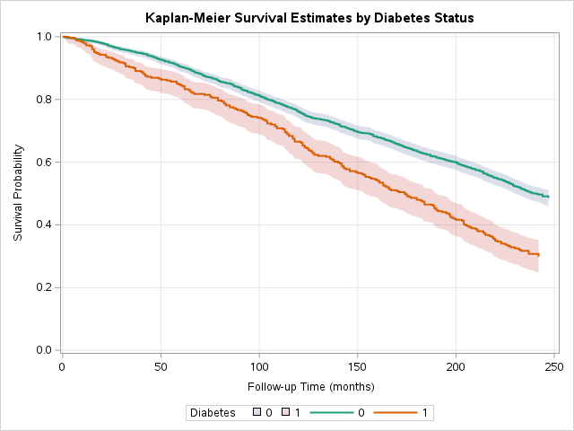

# Cardiovascular Risk Factors and Mortality: A NHANES Cohort Analysis

A SAS-based epidemiologic analysis of midlife cardiovascular risk factors and their
association with all-cause and cardiovascular mortality, using the National Health
and Nutrition Examination Survey (NHANES) linked to the CDC/NCHS Public-Use Linked
Mortality File.

**Why this project:** built to demonstrate the workflow of a longitudinal
cardiovascular epidemiology cohort analysis — data management, a written statistical
analysis plan, table shells, and Cox proportional hazards regression — the same core
tasks as an NHLBI-funded cohort study such as [ARIC](https://sites.cscc.unc.edu/aric/).
NHANES was chosen because, like ARIC, it is a nationally recognized cohort with public,
freely downloadable exam and mortality follow-up data, so the full pipeline can be
reproduced by anyone from raw data to final report.

## Data Source

- **NHANES 1999–2000** exam and questionnaire components (demographics, body
  measures, blood pressure, cholesterol, smoking, diabetes). Public domain,
  distributed by CDC/NCHS as SAS transport (`.xpt`) files:
  https://wwwn.cdc.gov/nchs/nhanes/Default.aspx
- **NHANES Public-Use Linked Mortality File** (through the most recent NCHS
  mortality follow-up period), providing person-time of follow-up and vital status:
  https://www.cdc.gov/nchs/data-linkage/mortality-public.htm

Raw data files are not committed to this repo (see `data/raw/README.md` for why and
how to obtain them) — only derived, de-identified summary tables and code are tracked.

## Repository Structure

```
nhanes-cvd-mortality-project/
├── README.md
├── docs/
│   ├── statistical_analysis_plan.md   # written SAP, produced before any analysis
│   ├── table_shells.md                # blank table shells alongside the filled-in results
│   ├── results_summary.md             # findings, in plain language
│   └── bias_and_limitations.md        # bias-mitigation decisions and their tradeoffs
├── data/
│   └── raw/                           # NHANES .xpt files + mortality file (gitignored)
├── sas/
│   ├── 01_import_nhanes.sas           # read .xpt components into native SAS datasets
│   ├── 02_import_mortality.sas        # read the NCHS mortality linkage file
│   ├── 03_merge_and_derive.sas        # merge components, apply eligibility, derive variables
│   ├── 04_table1.sas                  # Table 1 shell: baseline characteristics
│   ├── 05_cox_regression.sas          # Cox proportional hazards models
│   └── 06_km_curves.sas               # Kaplan-Meier survival curves (PROC SGPLOT)
└── output/
    ├── tables/                        # ODS RTF/PDF table output
    └── figures/                       # Kaplan-Meier curves, diagnostics
```

## Reproducing the Analysis

1. Download the NHANES 1999–2000 components and mortality file listed above into
   `data/raw/` (see `data/raw/README.md`).
2. Run the SAS programs in `sas/` in numeric order in SAS OnDemand for Academics
   (or any SAS 9.4+ environment).
3. Formatted tables and figures are written to `output/`.

## Results

**Figure 1. Kaplan-Meier survival by smoking status.** Unadjusted probability
of survival over ~20 years of follow-up among NHANES 1999–2000 participants
aged ≥45, stratified by baseline smoking status, with 95% confidence bands.
Never smokers show consistently higher survival than current or former
smokers. See the note in `docs/results_summary.md` on why former smoking
appears similar to current smoking here despite not being significant in
the adjusted Cox model — a confounding-by-age effect.



**Figure 2. Kaplan-Meier survival by diabetes status.** Same population and
follow-up period, stratified by baseline diabetes diagnosis. Participants
with diabetes show a consistent, widening survival disadvantage over time,
consistent with the adjusted hazard ratio of 1.65 reported below.



- [Table shells (blank) alongside filled-in results](docs/table_shells.md)
- [Table 1 — Baseline Characteristics (PDF)](output/tables/table1_baseline_characteristics.pdf)
- [Table 2/3 — Cox Proportional Hazards Models (PDF)](output/tables/table2_cox_models.pdf)
- [Results summary, in plain language](docs/results_summary.md)
- [Bias-mitigation decisions and their tradeoffs](docs/bias_and_limitations.md)

## Status

Analysis complete. See `docs/statistical_analysis_plan.md` for the analysis plan,
`docs/results_summary.md` for findings, and `docs/bias_and_limitations.md` for
how bias was considered and handled at each stage.
