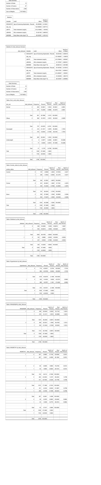
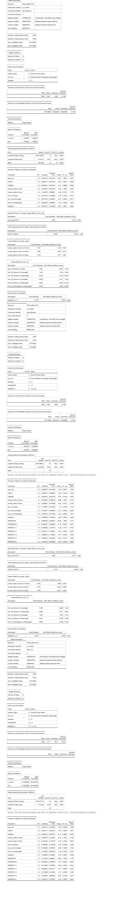

# Full SAS Output Tables

The complete, unedited SAS ODS output for Table 1 and Tables 2/3, as images
(GitHub's inline PDF preview is unreliable for some files, so these are
provided as images instead, which always render). The same content is also
available as an RTF download in `output/tables/` if you'd rather open it
directly, and a curated, plain-language summary is in `docs/results_summary.md`.

## Table 1 — Baseline Characteristics

Overall and by-vital-status weighted means (age, blood pressure, cholesterol,
HDL, BMI), followed by weighted breakdowns of BMI category, smoking status,
diabetes, hypertension, sex, and race/ethnicity.

## Tables 2 & 3 — Cox Proportional Hazards Models

Three models in sequence: unadjusted all-cause mortality, adjusted all-cause
mortality (Table 2), and adjusted cardiovascular mortality (Table 3) — each
showing model setup, parameter estimates, and hazard ratios.

