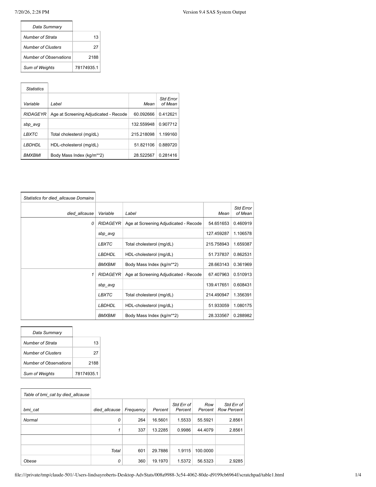
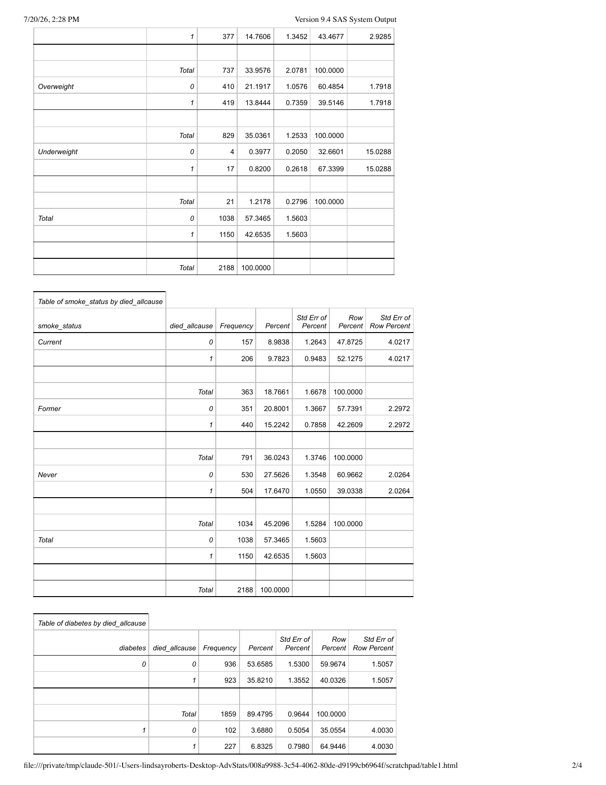
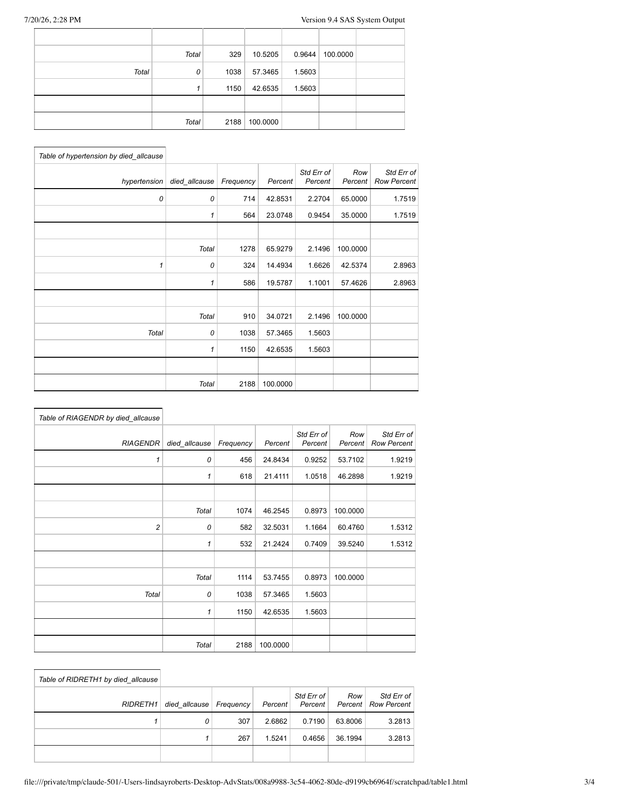
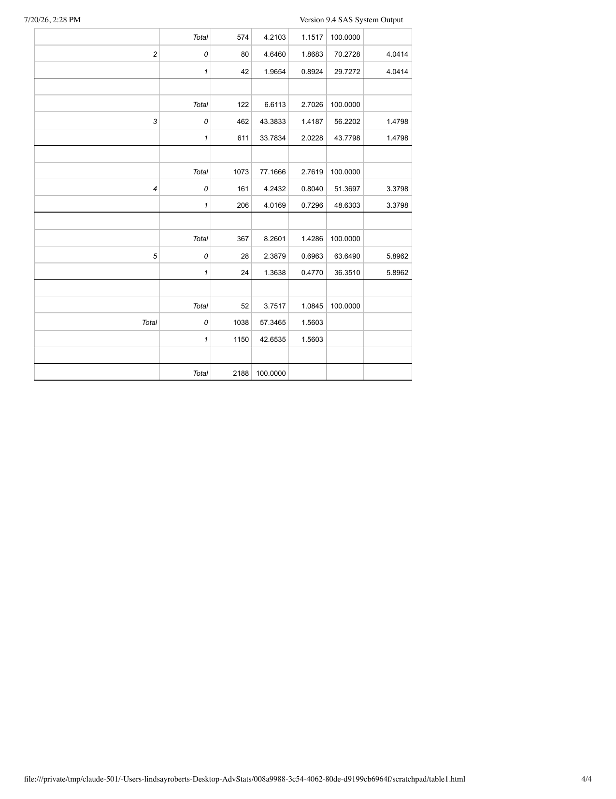
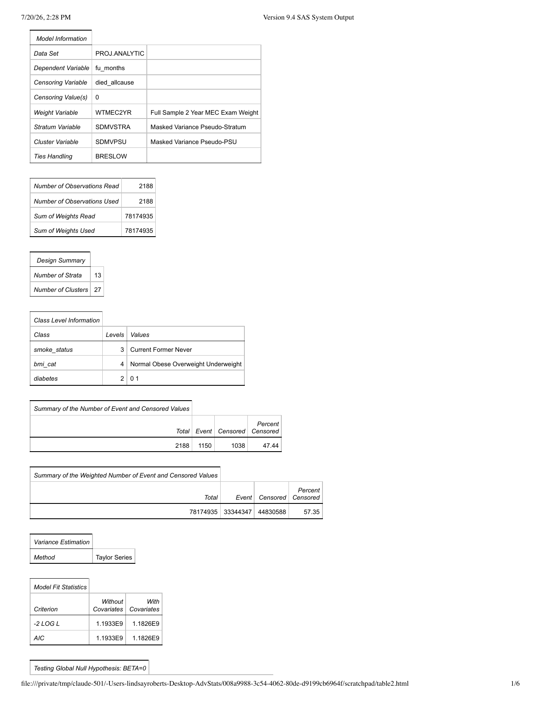
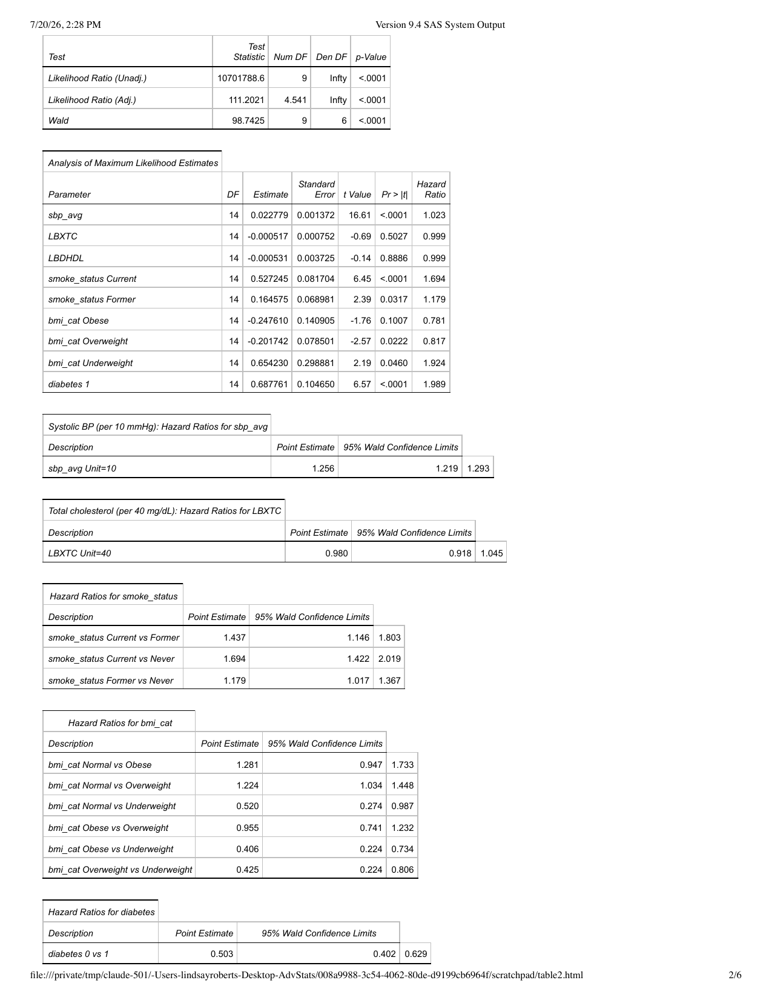
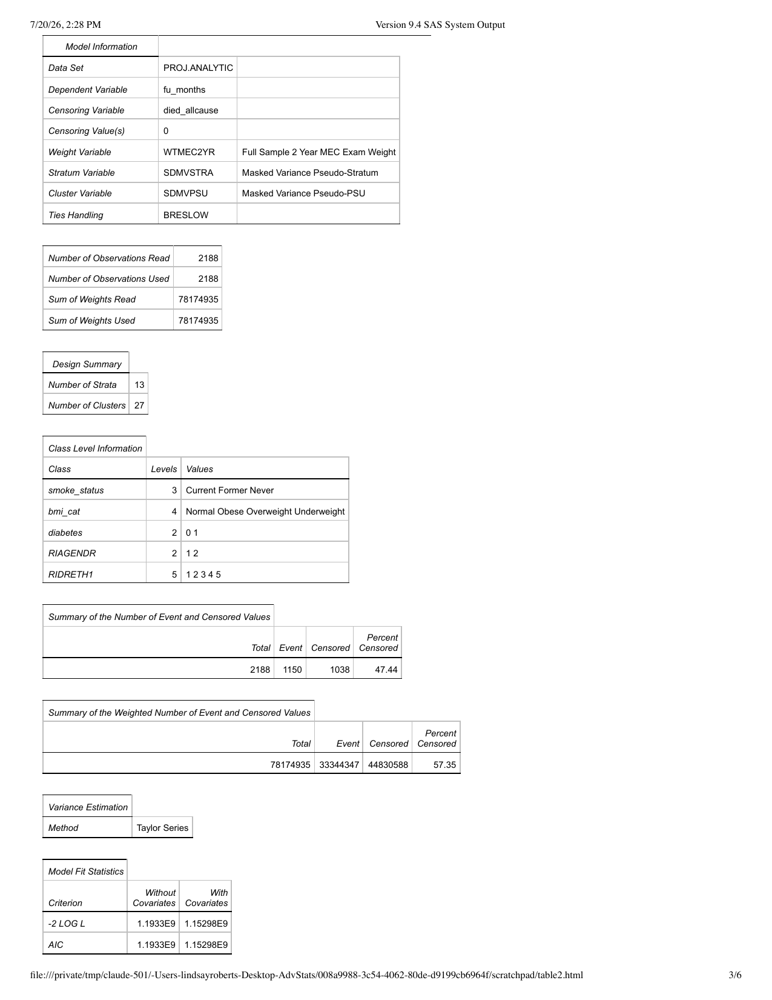
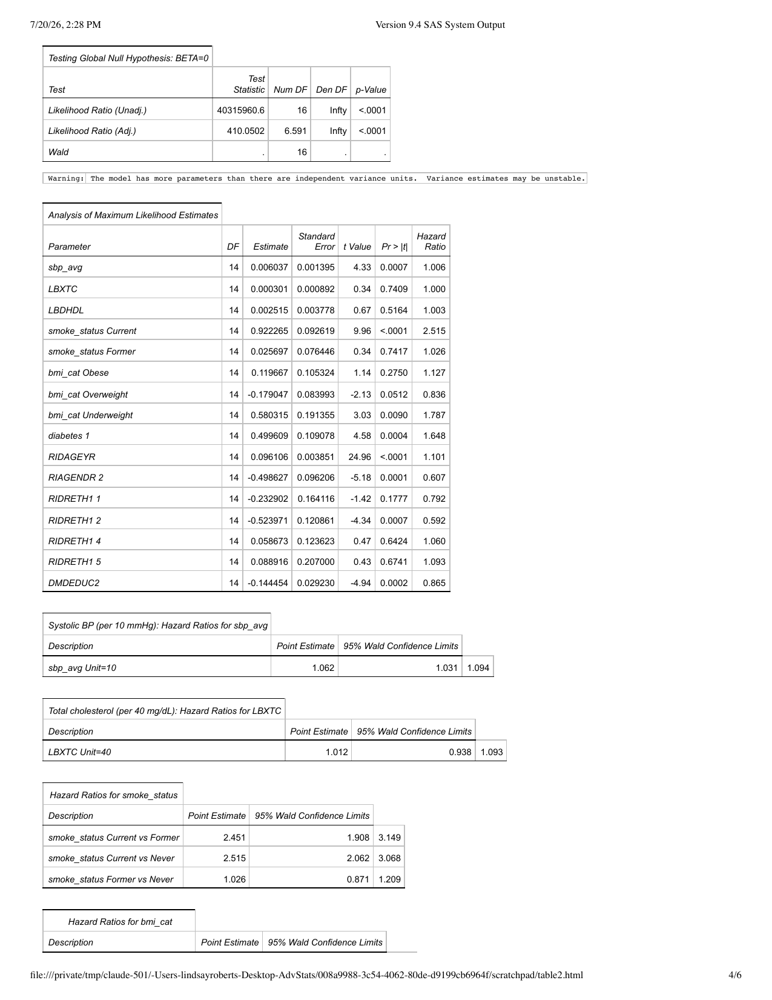
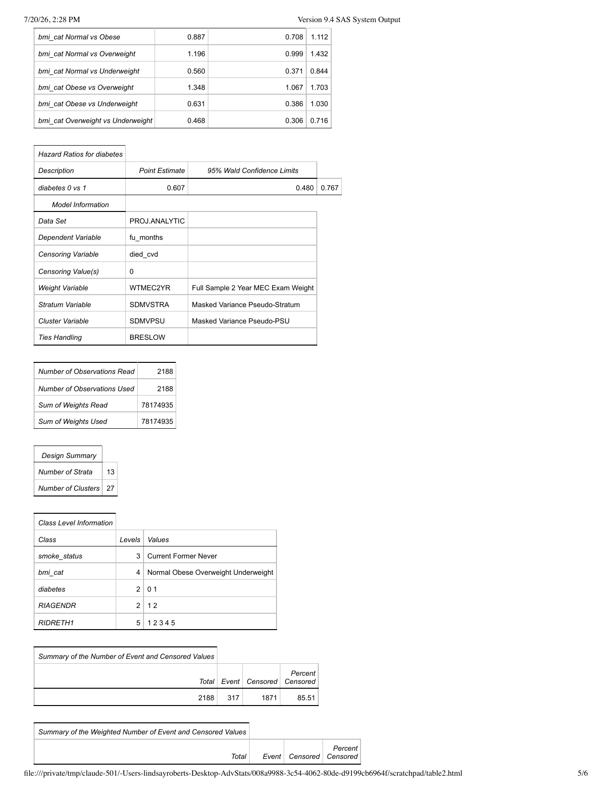
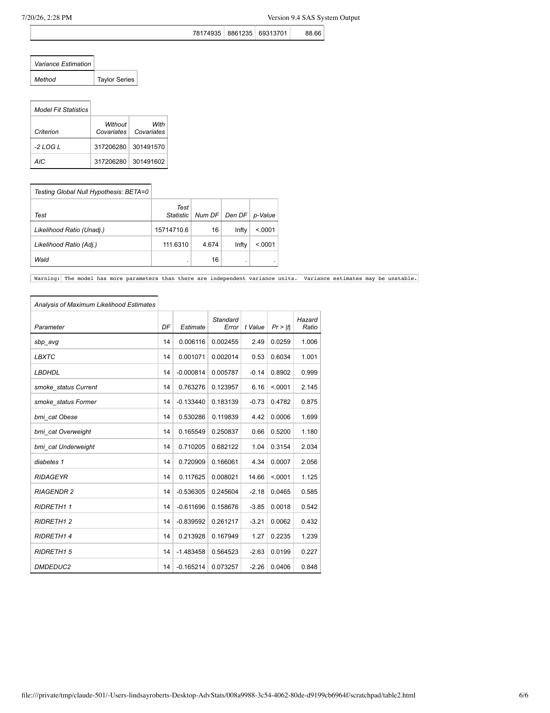

# Full SAS Output Tables

The complete, unedited SAS ODS output for Table 1 and Tables 2/3, as page
images (GitHub's inline PDF preview is unreliable for some files, so these
are provided as images instead, which always render). The same content is
also available as a PDF/RTF download in `output/tables/` if you'd rather
open it directly, and a curated, plain-language summary is in
`docs/results_summary.md`.

## Table 1 — Baseline Characteristics

## Tables 2 & 3 — Cox Proportional Hazards Models

